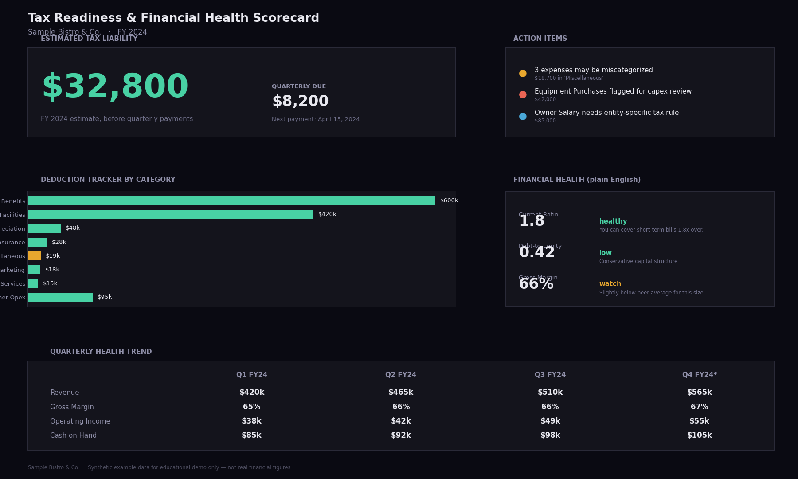
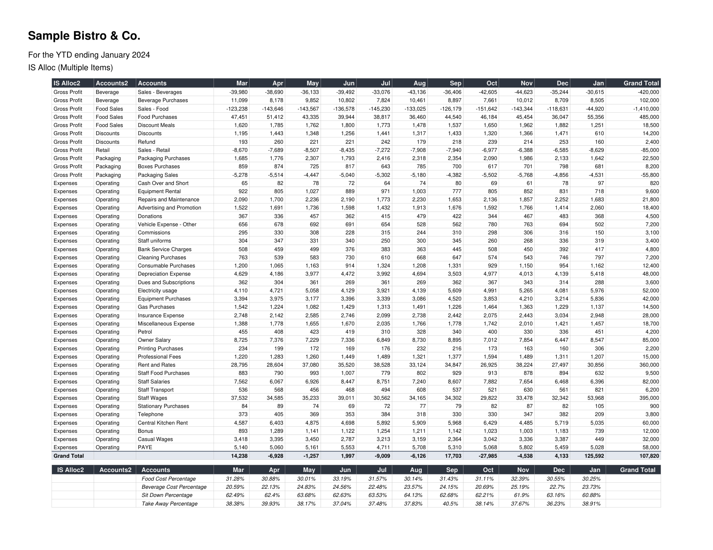
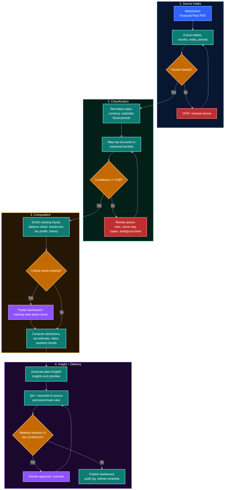

<div align="center">


# Build AI Workflows in 5 Steps

**A CompleteTech LLC lesson — from goal image to executable workflow code, in one notebook, any AI provider.**


<br/>



<br/><br/>

1. The notebook starts with this target dashboard: a financial health scorecard for a fictional restaurant.

<br/><br/>

<a href="assets/source_financial_pack.pdf">
  
</a>

<br/><br/>

2. Then it loads the built-in source document: a synthetic one-page financial pack for Sample Bistro &amp; Co. Click the preview to open the full PDF.

<br/><br/>



<br/><br/>

3. Then the AI designs a workflow that explains how to get from the source document to the target dashboard.

</div>

---

This repository is a teaching notebook about a repeatable AI workflow design method, not a restaurant-finance product. The shipped example is just the lesson vehicle: a messy synthetic restaurant financial PDF goes in, a target scorecard image defines the end state, and the AI learns to design the transformation between them.

Watch an AI read the goal image, then the source document, then decompose the transformation into a workflow, render that workflow as Mermaid, and finally write reusable Python for the deterministic steps. By the end you've turned a messy PDF into an executable AI pipeline while learning the five-step method behind the lesson and the prompting patterns that transfer to other goal-image plus source-document problems.

If you want to follow the exact built-in example before swapping in your own files, open the lesson's default source PDF: [assets/source_financial_pack.pdf](assets/source_financial_pack.pdf).

## The default example

- **Goal:** a financial health and tax-readiness dashboard image in [assets/target_dashboard.png](assets/target_dashboard.png)
- **Source:** a synthetic one-page financial pack for **Sample Bistro & Co.** in [assets/source_financial_pack.pdf](assets/source_financial_pack.pdf)
- **Lesson objective:** have the AI infer the workflow that can transform the source into the goal, then crystallize that workflow into executable Python

The notebook deliberately uses a source document with realistic friction: non-calendar fiscal periods, negative revenue conventions, ambiguous line items like owner salary, and messy PDF extraction. Those edge cases are part of the lesson, because they force the AI to surface judgment points instead of pretending the input is clean.

## What you'll learn

1. **Context Priming** — load your goal and source into the AI in stages
2. **Task Decomposition** — have the AI design a repeatable workflow with a structured execution contract
3. **Visual Workflow Design** — render the workflow as a Mermaid diagram
4. **Workflow Crystallization** — turn the workflow into executable code so future runs skip the expensive AI calls

## Audience

Total beginners (no Python experience) through experienced developers. The notebook ships with a collapsed adapter cell and inline "under the hood" sidebars so both audiences can get value from the same file.

## Quickstart

```bash
# 1. Clone
git clone https://github.com/CompleteTech-LLC/build-ai-workflows-in-5-steps.git
cd build-ai-workflows-in-5-steps

# 2. Create your .env from the template
cp .env.example .env
# then open .env and paste your API key for ONE provider

# 3. Open the notebook in VS Code or Jupyter
code build_ai_workflows_in_5_steps.ipynb
# or: jupyter lab build_ai_workflows_in_5_steps.ipynb

# 4. Run All
```

The notebook auto-detects which provider you have a key for and uses it. No other configuration required.

## What you need

- **Python 3.10+**
- **One API key** from Anthropic, OpenAI, or Google (not all three)
- **VS Code with the Python + Jupyter extensions**, or classic JupyterLab, or Google Colab

### Getting an API key

| Provider | Where to sign up | Free tier? |
|---|---|---|
| **Anthropic** (Claude) | https://console.anthropic.com/settings/keys | $5 trial credit |
| **OpenAI** (GPT) | https://platform.openai.com/api-keys | Pay-as-you-go |
| **Google** (Gemini) | https://aistudio.google.com/apikey | Yes — generous free tier, no credit card |

**Recommended starting point:** Google AI Studio. Free key in under 60 seconds, no credit card.

## Default models (latest flagships, April 2026)

| Provider | Model | Input / Output ($/M tok) |
|---|---|---|
| Anthropic | `claude-opus-4-6` | $5.00 / $25.00 |
| OpenAI | `gpt-5.4` | $2.50 / $15.00 |
| Google | `gemini-3.1-pro-preview` | $2.00 / $12.00 |

Running the whole notebook once costs roughly **$0.10–$0.50** at flagship-tier. You can swap in cheaper mid-tier models by passing `AIClient("anthropic", model="claude-haiku-4-5")` in Cell 6.

## Repo layout

```
build-ai-workflows-in-5-steps/
├── build_ai_workflows_in_5_steps.ipynb   # the lesson, 29 cells
├── README.md                              # you are here
├── LICENSE                                # MIT © 2026 CompleteTech LLC
├── requirements.txt                       # 5 dependencies
├── .env.example                           # template for your API key
├── .gitignore
├── assets/
│   ├── completetech_logo.jpg / .svg
│   ├── target_dashboard.png               # default goal (swappable)
│   ├── source_financial_pack.pdf          # default source (swappable)
│   ├── source_financial_pack_preview.png  # README preview of the default source PDF
│   ├── reference_workflow.mmd             # hand-authored Mermaid for comparison
│   └── reference_decomposition.md         # hand-authored decomposition for comparison
└── scripts/
    ├── build_notebook.py                  # regenerates the .ipynb from Python source
    ├── generate_assets.py                 # regenerates the synthetic PDF + dashboard
    └── README.md                          # how to use the build scripts
```

## Using your own files

Open the notebook, scroll to **Cell 7 — YOUR INPUTS**, and change the two paths:

```python
TARGET_IMAGE = "path/to/your-goal.png"
SOURCE_DOC   = "path/to/your-source.pdf"
```

Re-run. The whole workflow retargets. Try:

- A Slack thread screenshot + a meeting transcript → action-item extractor
- A finished report PDF + raw interview notes → report-drafting workflow
- A filled-out form screenshot + a source database dump → form-filling agent

## What this notebook deliberately doesn't teach

- **Prompt caching.** Production workflows should use `cache_control` blocks on Anthropic and automatic caching on OpenAI/Gemini for 75–90% discounts on repeated context. Out of scope for the primer.
- **Streaming.** Blocking calls only, for simplicity.
- **Multi-agent orchestration.** The workflow is sequential. Production systems often fan out to parallel agents.
- **Evaluation.** We don't score the decomposition against ground truth. Production LLM workflows need evals.

Pointers to all four are in the Citations cell at the end of the notebook.

## License and attribution

Source code is licensed under the **MIT License**. See [LICENSE](LICENSE).

The **method and teaching material** — the integration and pedagogical sequencing of goal-first context priming, source priming, structured decomposition, Mermaid visualization, and code crystallization — are © 2026 CompleteTech LLC. You may freely use, adapt, and teach from this content; attribution to CompleteTech LLC is appreciated.

The individual prompt engineering techniques are drawn from published research and vendor documentation cited in the final cell of the notebook. This lesson's contribution is the *integration* of those techniques into a single repeatable methodology.

## Feedback and contributions

Issues and pull requests welcome. If you build something interesting with a swapped-in source document, we'd love to see it.

---

**© 2026 CompleteTech LLC** — [complete.tech](https://complete.tech)
