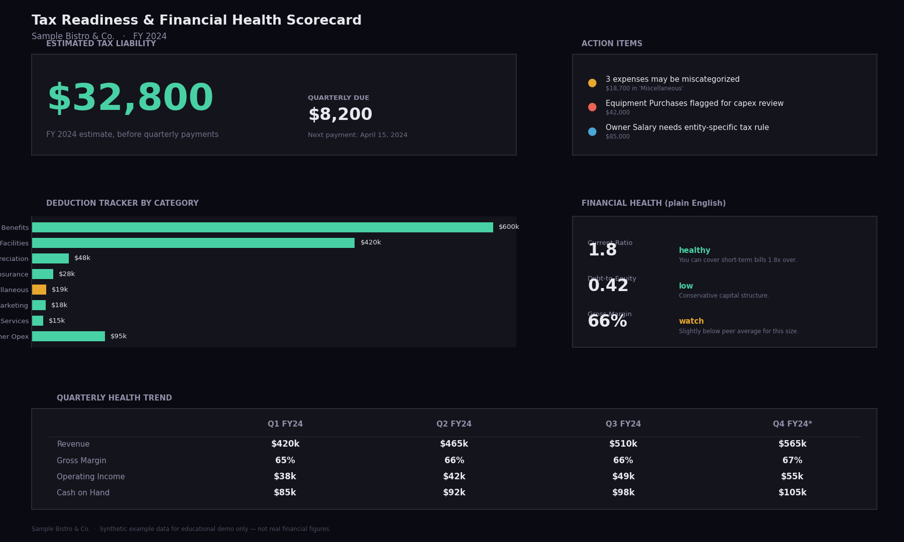

<div align="center">


# Build AI Workflows in 6 Steps

**A CompleteTech LLC lesson — from a goal image to executable workflow code, then a reusable skill.**




</div>

This is a general-purpose workflow-design lesson, not a restaurant-finance product.
The example pairs a target scorecard with a messy, synthetic financial pack for
**Sample Bistro & Co.** The method transfers to other source-document and target-image tasks.

**New: Step 6 packages the workflow you just built as an Agent Skill.** It exports
instructions, unchanged workflow artifacts, onboarding, review gates, branding,
validation, and a ZIP without another AI call or automatic execution.

The repository URL and original `build_ai_workflows_in_5_steps.ipynb` remain stable
for existing links and teaching material. Continue in
[create_workflow_skill.ipynb](create_workflow_skill.ipynb), or build the combined
six-step notebook using the command below.

## The six steps

| Step | What you do | Result |
|---|---|---|
| 1. Goal priming | Show the AI the intended output. | Shared target context. |
| 2. Source priming | Load the source document. | Shared source context. |
| 3. Task decomposition | Design the transformation and decision boundaries. | `outputs/decomposition.md` |
| 4. Visual workflow design | Express the workflow in Mermaid. | `outputs/workflow.mmd` |
| 5. Workflow crystallization | Generate reusable Python for deterministic work. | `outputs/workflow.py` |
| **6. Skill packaging** | Capture the completed workflow for reuse on new inputs. | **Skill folder + ZIP in `outputs/skills/`** |

The first five steps use the notebook's Anthropic, OpenAI, or Google adapter.
Step 6 is deterministic, standard-library-only Python. It does not need an API key.
A packaged workflow may still need an approved AI adapter at its judgment points.

## Quickstart

```bash
git clone https://github.com/CompleteTech-LLC/build-ai-workflows-in-5-steps.git
cd build-ai-workflows-in-5-steps
cp .env.example .env
# Set ONE provider key in .env for Steps 1-5. Never commit this file.

# Generate the combined lesson; this builds notebook files, not AI outputs.
python scripts/build_skill_notebook.py
jupyter lab build_ai_workflows_in_6_steps.ipynb
```

Use Python 3.10+ and JupyterLab or VS Code's Python/Jupyter extensions. The original
lesson installs its provider/PDF dependencies in a notebook cell. Review those
installs and the provider's current model availability/pricing before running live calls.
The model and pricing examples retained in the original notebook are historical,
not a guarantee of current cost or availability.

The combined notebook has all six steps in order. Alternatively, run the existing
five-step notebook, then open `create_workflow_skill.ipynb` in a fresh or existing
kernel. Step 6 reads saved artifacts; it does not need the earlier chat history.

[Onboarding](ONBOARDING.md) · [Step 6 guide](docs/step-6-create-a-skill.md) · [Branding](BRANDING.md)

## Export a skill from an already completed workflow

```bash
python scripts/create_workflow_skill.py \
  --outputs outputs \
  --name financial-scorecard-workflow \
  --title "Financial Scorecard Workflow" \
  --description "Prepare a draft scorecard from a financial pack and target image. Use for the reviewed financial-scorecard workflow, not tax advice or filing."

python scripts/validate_skill.py outputs/skills/financial-scorecard-workflow
```

Change the name, title, and description for your actual workflow. The description
should say what the skill does and when it should be used, rather than broadly
claiming to solve every task. The exporter refuses to overwrite existing exports;
use a new `--destination` or name for another version.

### Offline example — no credentials required

```bash
python scripts/create_workflow_skill.py \
  --outputs examples/workflow --destination outputs/demo-skills \
  --name text-summary --title "Text Summary" \
  --description "Count words in a supplied text file. Use for text-summary tasks."
```

This exports a small synthetic text-summary fixture. It tests packaging, not the
financial workflow, model quality, or domain correctness.

## What Step 6 creates

```text
outputs/skills/<skill-name>/
├── SKILL.md                     # scoped trigger, procedure, inputs, approval gates
├── README.md                    # brand-aware entry page
├── ONBOARDING.md                # review, setup, installation, first-run guidance
├── LICENSE
├── skill-package.json           # version, review status, provenance, SHA-256 hashes
├── requirements.txt             # Step 5 runtime dependency allowance; review/pin
├── inputs.example.json
├── agents/openai.yaml           # UI branding; implicit invocation disabled
├── scripts/
│   ├── workflow.py              # exact Step 5 bytes; never imported by exporter
│   └── validate_skill.py        # self-contained structural/integrity checker
├── references/
│   ├── decomposition.md        # exact Step 3 bytes
│   ├── workflow.mmd            # exact Step 4 bytes
│   └── review-checklist.md
└── assets/
    ├── brand-profile.json
    └── logo.jpg                # optional PNG/JPEG; absent for text-only/unbranded
outputs/skills/<skill-name>.zip  # one top-level skill directory
```

No raw source documents, target images, `.env` files, provider SDKs, or notebook
histories are copied. Derived artifacts can still contain private information;
review every file before sharing. Credential detection is a best-effort pattern
check, not a guarantee that a package is free of secrets or personal data.

## Branding that follows the workflow

An explicit `--brand-profile path/to/brand-profile.json` wins. Otherwise Step 6
uses `outputs/brand-profile.json` when present. Only workflows without a profile
receive the **CompleteTech LLC starter**: the existing repository logo and the
palette/tagline from `agentic-delivery-skill`.

Custom identities are never silently mixed with CompleteTech's. Invalid profiles
fail rather than falling back. `--unbranded` explicitly disables output branding.
The versioned profile travels with the skill for downstream renderers; packaging
does not rewrite arbitrary generated code to apply the theme. See [BRANDING.md](BRANDING.md).

## Review before reuse

**A valid package is not a validated workflow.** The exporter checks Python syntax,
entrypoint shape, names, required files, safe paths, and hashes; it does not execute
the generated code or certify business logic. Packages are marked **unreviewed**.

Read `ONBOARDING.md` and `references/review-checklist.md`. Inspect code before import,
review dependencies, approve execution explicitly, and test synthetic success and
failure cases in an isolated environment. Provide a compatible approved `ai.ask`
adapter when needed; do not fabricate missing judgments or financial values.

After review, manually place the skill folder under your project's `.agents/skills/`
for Codex or `.claude/skills/` for Claude Code. Host permissions still apply. Nothing
is installed, executed, pushed to a registry, or published automatically.

## The original lesson assets

[Source financial PDF](assets/source_financial_pack.pdf) ·
[Source preview](assets/source_financial_pack_preview.png) ·
[Target dashboard](assets/target_dashboard.png) ·
[Reference workflow](assets/reference_workflow.mmd) ·
[Reference decomposition](assets/reference_decomposition.md)

The financial example deliberately includes non-calendar fiscal periods, negative
revenue conventions, ambiguous line items, and messy PDF extraction. Those are
judgment points to surface, not reasons to pretend the input is clean.

For a different task, change `TARGET_IMAGE` and `SOURCE_DOC` in the original lesson's
**YOUR INPUTS** cell, review any example-specific prompts in Step 5, and customize
the Step 6 skill metadata. The exporter itself is not tied to finance.

## Development and validation

```bash
# Rebuild the standalone Step 6 notebook only.
python scripts/build_skill_notebook.py --capstone-only

# Rebuild the original lesson, continuation, and combined six-step notebook.
python scripts/build_skill_notebook.py

# Offline regression tests; no provider credentials or third-party dependencies.
python -m unittest discover -s tests -v
```

The original builder remains the source of truth for Steps 1–5. The new builder
inserts Step 6 before the recap, preserving the earlier code cells. The combined
notebook is generated (not committed); CI builds it and publishes it as a workflow
artifact alongside the synthetic example skill. The checked-in continuation is
reproducible from `scripts/build_skill_notebook.py`.

This primer still does not provide a production deployment, domain evaluation,
prompt-caching strategy, streaming UI, or multi-agent orchestration. Step 6 adds
structural validation and a review handoff, not those missing runtime capabilities.

## Standards and attribution

[Agent Skills specification](https://agentskills.io/specification) ·
[Codex skills](https://developers.openai.com/codex/skills/) ·
[Claude Code skills](https://code.claude.com/docs/en/skills)

Code is MIT licensed; see [LICENSE](LICENSE). Teaching material and lesson
integration © 2026 CompleteTech LLC. The original notebook retains its research
and vendor references. The Agent Skills format is an external open specification,
not a CompleteTech invention. Brand marks remain their owners' property; the
starter does not grant endorsement or ownership of customer output.

**© 2026 CompleteTech LLC** — [complete.tech](https://complete.tech)
